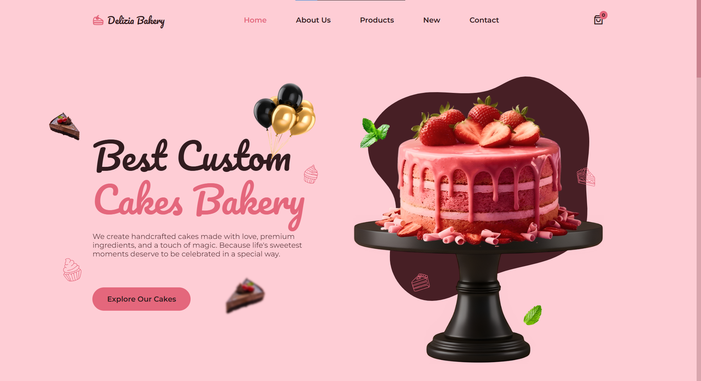
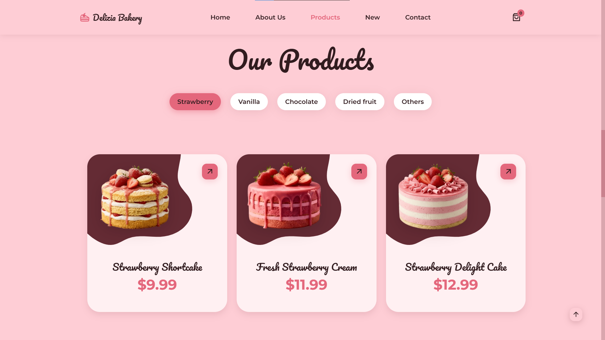
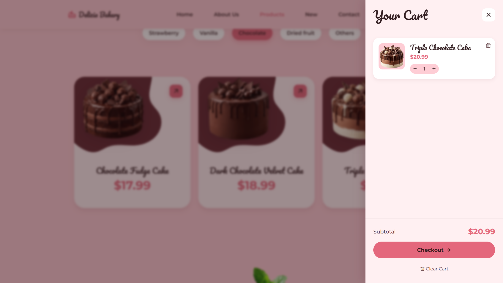
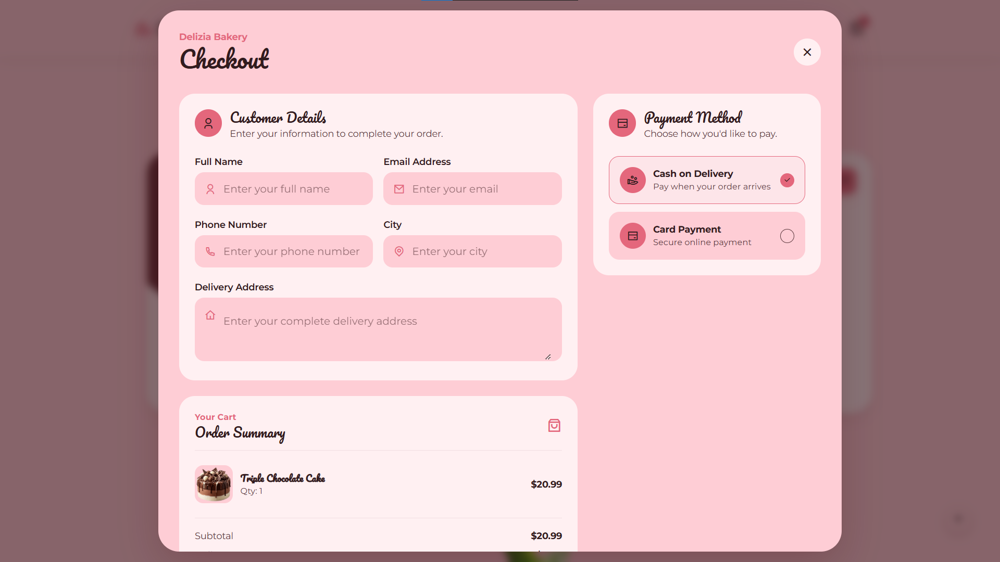
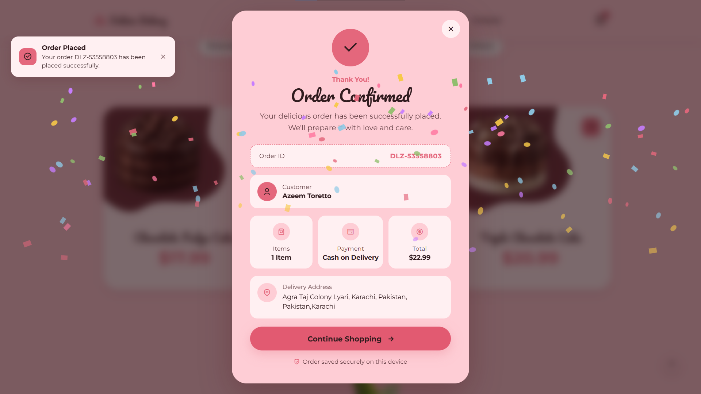

<div align="center">


</div>

<div align="center"><h1>🍰 Delizia Bakery</h1></div>

### A Modern & Responsive Bakery Website

Delizia Bakery is a modern, elegant, and fully responsive bakery website designed to provide a smooth and delightful online cake-shopping experience.

The website features a beautiful bakery-focused UI, categorized products, interactive shopping cart, checkout experience, payment selection, order confirmation, and responsive layouts for different screen sizes.

🔗 **Live Demo:**
https://delizia-bakery.netlify.app/

---

## ✨ Features

* 🎂 Beautiful modern bakery UI
* 📱 Fully responsive design
* 🧁 Product categories
* 🍓 Strawberry, Vanilla, Chocolate & other cake collections
* 🛒 Interactive shopping cart
* ➕ Add products to cart
* 🗑️ Remove products from cart
* 💰 Automatic cart subtotal calculation
* 🚚 Delivery fee calculation
* 🛍️ Complete checkout experience
* 👤 Customer information form
* 💳 Cash on Delivery & Card Payment options
* ✅ Order confirmation screen
* 🆔 Order ID generation
* 💾 Order information saved locally
* 🎨 Smooth animations and interactive UI
* 📍 Contact & bakery information section
* 📱 Mobile-friendly navigation
* ⚡ Fast and lightweight frontend

---

## 🖥️ Screenshots

### 🏠 Home



### 🍰 Products



### 🛒 Shopping Cart



### 💳 Checkout



### ✅ Order Confirmation



> 📸 All screenshots are available inside the `screenshots` folder.

---

## 🛠️ Technologies Used

* **HTML5** — Website structure
* **CSS3** — Styling, responsive layouts & animations
* **JavaScript** — Interactivity and functionality
* **Git & GitHub** — Version control
* **Netlify** — Deployment

---

## 🧁 Product Categories

Delizia Bakery includes multiple product categories to make browsing easier:

* 🍓 Strawberry
* 🍦 Vanilla
* 🍫 Chocolate
* 🌰 Dried Fruit
* 🍰 Other Desserts

The website includes a variety of cakes, brownies, cupcakes, and other sweet creations.

---

## 🛒 Shopping & Checkout

The website includes a complete frontend shopping experience.

Users can:

1. Browse available cakes
2. Select their favorite products
3. Add products to the cart
4. Review their cart
5. Proceed to checkout
6. Enter customer details
7. Select a payment method
8. Place the order
9. View their order confirmation

The checkout interface includes customer details, delivery information, payment selection, order summary, delivery fee, and final order confirmation.

---

## 📂 Project Structure

```text
Delizia-Bakery/
│
├── assets/
│   ├── css/
│   ├── js/
│   └── img/
│
├── screenshots/
│   ├── home.png
│   ├── products.png
│   ├── cart.png
│   ├── checkout.png
│   └── order-confirmation.png
│
├── index.html
└── README.md
```

---

## 🎯 Project Goals

The main goal of Delizia Bakery was to create a visually appealing bakery website that combines:

* Modern UI design
* Responsive development
* Product browsing
* Shopping cart functionality
* Checkout flow
* Interactive user experience

The project was built with a focus on creating a polished frontend experience without relying on heavy frameworks.

---

## 🚀 Live Demo

### 🍰 Visit Delizia Bakery

👉 **https://delizia-bakery.netlify.app/**

---

## 👨‍💻 Developed By

### **Azeem Toretto**

Frontend Web Developer passionate about building modern, responsive, and interactive web experiences.

---

## 🌐 Connect With Me

* 🐙 **GitHub:** https://github.com/Azeem-Toretto-1
* 💼 **LinkedIn:** https://www.linkedin.com/in/azeem-toretto
* 📸 **Instagram:** https://www.instagram.com/azeem_dev
* ▶️ **YouTube:** https://www.youtube.com/@Azeem-Dev-51

---

## ⭐ Support

If you like this project, consider giving it a ⭐ on GitHub.

Your support helps me continue building and sharing more creative web projects. ❤️

---

### 🍰 Delizia Bakery

**Fresh. Beautiful. Delicious.**

Built with ❤️ by **Azeem Toretto**
